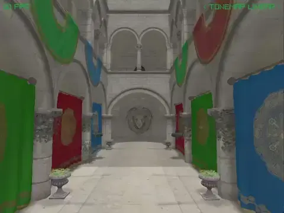
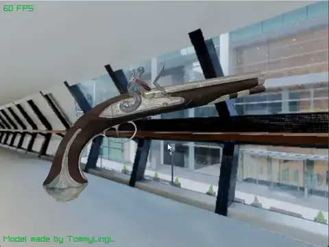
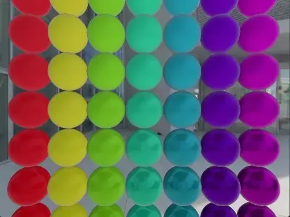

# R3D - 3D Rendering Library for raylib


<br>
R3D is a modern 3D rendering library for <a href="https://www.raylib.com/">raylib</a> that provides advanced lighting, shadows, materials, and post-processing effects without the complexity of building a full engine from scratch.
<br clear="left">

---

> [!WARNING]
> **It is recommended to use the pre-release tags.**
> While you can use the master branch, unexpected API breaking changes may occur until the first official release is published.

---

## Key Features

- **Hybrid Renderer**: Deferred pipeline with forward rendering for transparency.
- **Advanced Materials**: Complete PBR material system (Burley/SchlickGGX)
- **Dynamic Lighting**: Directional, spot, and omni lights with soft shadows
- **Image-Based Lighting**: Supports environment IBL and reflection probes.
- **Post-Processing**: SSAO, SSR, DoF, bloom, fog, tonemapping, and more
- **Model Loading**: Assimp integration with animations and mesh generation
- **Performance**: Built-in frustum culling, instanced rendering, and more

## Requirements

To build R3D, you must have:
- **raylib 5.5+** (optionally provided as a submodule)
- **Assimp 6.0.3** (optionally provided as a submodule)
- **Python 3.6+** (used to process shaders during compilation)

To use R3D, the required specifications are:
- **OpenGL 3.3+** (with support for `GL_ARB_texture_cube_map_array`)

## Installation

If you don't know how to start and want to try it quickly:
```bash
git clone --depth 1 --recurse-submodules https://github.com/Bigfoot71/r3d
cd r3d
mkdir build && cd build
cmake .. -DR3D_RAYLIB_VENDORED=ON -DR3D_ASSIMP_VENDORED=ON
cmake --build .
```

Or you can use [r3dStarter](https://github.com/jensroth-git/r3dStarter) made by [Jens Roth](https://github.com/jensroth-git).

## Quick Start

```c
#include <r3d/r3d.h>
#include <raymath.h>

int main(void)
{
    InitWindow(800, 600, "R3D Example");
    SetTargetFPS(60);

    R3D_Init(800, 600);

    // Create scene objects
    R3D_Mesh mesh = R3D_GenMeshSphere(1.0f, 16, 32);
    R3D_Material material = R3D_GetDefaultMaterial();

    // Setup lighting
    R3D_Light light = R3D_CreateLight(R3D_LIGHT_DIR);
    R3D_SetLightDirection(light, (Vector3){-1, -1, -1});
    R3D_SetLightActive(light, true);

    // Camera setup
    Camera3D camera = {
        .position = {3, 3, 3},
        .target = {0, 0, 0},
        .up = {0, 1, 0},
        .fovy = 60.0f,
        .projection = CAMERA_PERSPECTIVE
    };

    // Main loop
    while (!WindowShouldClose()) {
        UpdateCamera(&camera, CAMERA_ORBITAL);
        BeginDrawing();
        R3D_Begin(camera);
        R3D_DrawMesh(mesh, material, Vector3Zero(), 1.0f);
        R3D_End();
        EndDrawing();
    }

    R3D_UnloadMesh(mesh);
    R3D_Close();
    CloseWindow();
    return 0;
}
```

## License

Licensed under the **Zlib License** - see [LICENSE](LICENSE) for details.

## Screenshots




